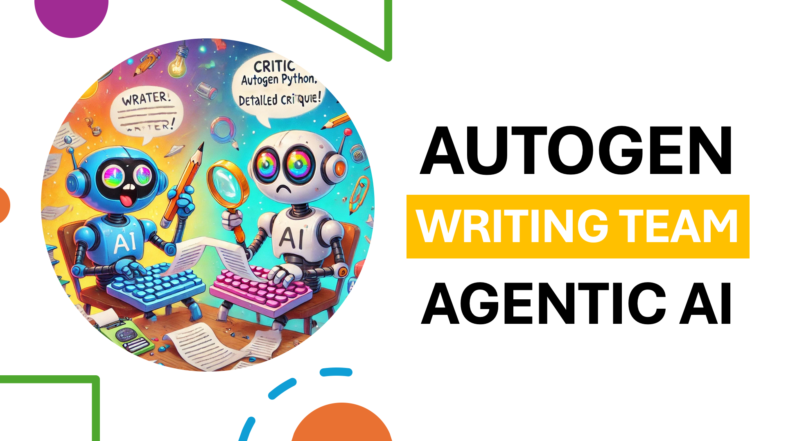

[Watch the video on YouTube](https://www.youtube.com/watch?v=R7cQVZXE-RE)

# Build an Agentic AI Writing Team using AutoGen Python
## By: Mohammad Hossein Amini

In this video, you'll learn how to build your own multi-agent AI writing team using AutoGen in Python. We'll create two LLM agents—a Writer and a Critic—that collaborate to produce high-quality written content automatically.

## What you'll learn:
- Defining agents: Writer (content creation) and Critic (content refinement)
- How these agents communicate and collaborate effectively
- How to terminate their conversation
- Asking or not asking for human feedback

## Resources:
- [AutoGen Documentation](https://microsoft.github.io/autogen/0.2/docs/Getting-Started/)

## Who should watch?
Anyone who knows a little bit of Python.

##  Getting Started
1. Install the required packages:
   ```bash
   pip install autogen
   ```

2. Insert your OpenAI API key as `api.txt` file in the same directory as the script. The file should contain only the API key, without any additional text or formatting.

3. Run the `writing.py` script:
   ```bash
   python writing.py
   ```

4. Enjoy :)