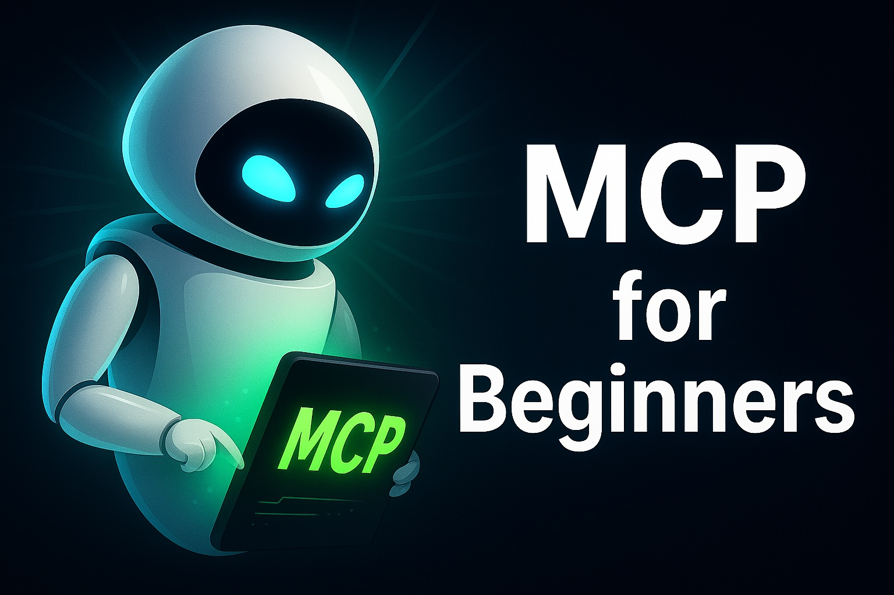

# MCP Made Easy: A Practical Introduction with Python Code (2025 Step-by-Step Tutorial)



[Watch on YouTube](https://www.youtube.com/watch?v=uDMLtWcYyNU)

## By: Mohammad Hossein Amini

## Overview

🚀 MCP Made Easy: A Practical Introduction with Python Code (2025 Step-by-Step Tutorial) 🚀

Ready to master Model Context Protocol (MCP) and see it in action? In this beginner-friendly tutorial, we’ll break down MCP into simple, actionable sections with clear code examples. No jargon, no confusion—just a hands-on guide to understanding and using MCP for AI developers! We will also see how to use MCP in AutoGen!

🎯 **What You’ll Learn**

✅ Motivation: Why MCP at all?!

✅ MCP Concepts (MCP Client, MCP Server, MCP Host, Transports)

✅ Some MCP Servers

✅ How to add an MCP Server to VSCode Github Copilot

✅ How to add an MCP Server to an AI Agent in AutoGen

👥 **Who’s This For?**

- Python developers curious about MCP and AI Agents

- Beginners looking for a clear, practical MCP introduction

- AI enthusiasts eager to add MCP to their skillset

- AI developers eager to use MCP in AutoGen

📺 **More Projects Like This:**

https://www.youtube.com/watch?v=YeJG_H-sw84&list=PLEe-UC96P-yaP7-jz3HLrieQdNNFuy_xN&index=2

## Getting Started

1. Install the required packages:

   ```bash
   pip install arxiv
   pip install -U "autogen-agentchat"
   pip install "autogen-ext[openai]"

   ```

2. Insert your OpenAI API key as `api.txt` file in the same directory as the script. The file should contain only the API key, without any additional text or formatting.

3. Run the `agent.py` script:

   ```bash
   python agent.py
   ```

4. Enjoy :)
