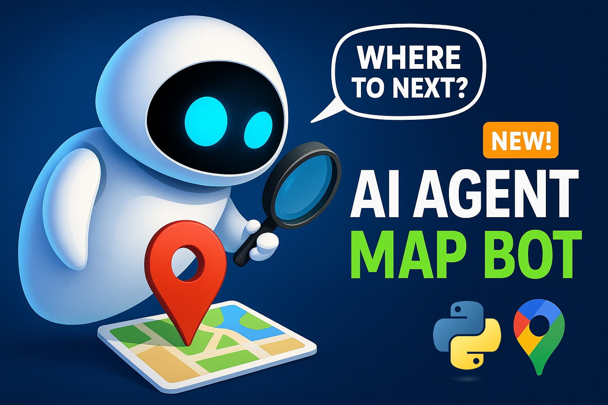

# AI Agent Chatbot for Google Maps [2025 Python from Scratch, AutoGen + MCP]



[Watch on YouTube](https://youtu.be/vbBJIrYh6Zc)

## By: Mohammad Hossein Amini

## Overview

🚀 **AI Agent Chatbot for Google Maps [2025 Python from Scratch, AutoGen + MCP]** 🚀

Ready to supercharge your skills in AI Agent development in Python? Let's build an AI Agent Chatbot for Google Maps with AutoGen and Model Context Protocol (MCP). In this hands-on guide, I’ll walk you through every line of code—from setting up your MCP server to building your agent and developing a web application UI with Streamlit like a pro!

### 🎯 What You’ll Learn

- ✅ 00:00 – Introduction & Project Overview
- ✅ 02:02 – Using o4-mini LLM from OpenAI and building AI Agent in AutoGen (Assistant Agent)
- ✅ 05:12 – Setting up Google Maps Model Context Protocol (MCP Server) in AutoGen
- ✅ 11:33 – Making a team (RoundRobinGroupChat) out of a single AI Agent in AutoGen
- ✅ 20:52 – The Challenge with the Termination Condition in AutoGen
- ✅ 24:41 – Problem: MCP Workbench and Tools at the same time in AutoGen
- ✅ 28:32 – Developing web application UI with Streamlit
- ✅ 41:41 – Problem: Previous chats get lost in Streamlit
- ✅ 48:33 – Problem: Previous team state is lost in AutoGen
- ✅ 49:58 – Testing our lovely chatbot :)
- ✅ 53:58 – Final words: DO IT YOURSELF :)

### 👥 Who’s This For?

- Python developers ready to level up with AI agents
- AI enthusiasts curious about integrating AutoGen & MCP
- Beginners looking for a clear, code-first walkthrough for Agentic AI and Model Context Protocol

📺 **More Projects Like This:**

https://www.youtube.com/watch?v=YeJG_H-sw84&list=PLEe-UC96P-yaP7-jz3HLrieQdNNFuy_xN&index=2

## Getting Started

1. Install the required packages:

   ```bash
   pip install -U "autogen-agentchat"
   pip install "autogen-ext[openai]"
   ```

2. Insert your OpenAI API key as `api_openai.txt` file and your Google Maps API key as `api_maps.txt` in the same directory as the script. The file should contain only the API key, without any additional text or formatting.

3. Run the `app.py` script:

   ```bash
   streamlit run app.py
   ```

4. Enjoy :)

## ❓ Have Questions?

Drop your questions or feature-requests in the comments on YouTube—let’s build smarter bots together!
