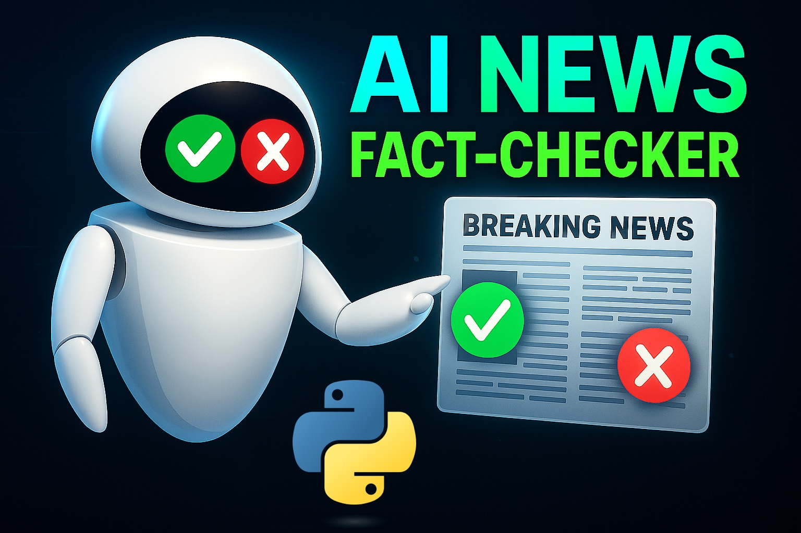

# 🚀 Build an AI Agent for News Fact-Checking in Python (2025 Step by Step Tutorial)



[Watch on YouTube](???)

## By: Mohammad Hossein Amini

## Overview

🚀 **Build an AI Agent for News Fact-Checking in Python (2025 Step by Step Tutorial)** 🚀

Ready to build your own AI Agent to put misinformation on notice? In this hands‑on guide, we’ll build an AI Agent that fact‑checks news headlines and statements in real time using Tavily’s Model Context Protocol (MCP) and AutoGen. I’ll walk you through every line of code—from spinning up a Tavily MCP server to verifying claims and shipping a slick Streamlit UI. No fluff, just actionable code you can copy, tweak, and deploy today! We'll **really** code...run into errors...and learn how to fix them together!

### 🎯 What You’ll Learn

✅ 00:00 – Introduction & Project Overview

✅ 01:23 – Importing OpenAI GPT-4o in AutoGen

✅ 03:13 – Building an AI Agent (AssistantAgent) in AutoGen

✅ 09:40 – Setting up Tavily Model Context Protocol (MCP) Server in AutoGen

✅ 15:45 – Building a team (RoundRobinGroupChat) from the AI Agent in AutoGen

✅ 17:56 – Orchestrating the team (AI Agent) in AutoGen

✅ 30:38 – Model Context for an AI Agent in AutoGen

✅ 46:05 – Developing a Custom Model Context for an AI Agent in AutoGen

✅ 01:01:01 – Improving the AI Agent’s System Message (Instructions)

✅ 01:07:25 – Build the web application ui with Streamlit

✅ 01:10:48 – Handling prompts from the User in Streamlit

✅ 01:34:56 – Using OpenAI GPT4.1 for the AI Agent and testing our lovely app :)

✅ 01:39:58 – Final Words: DO IT YOURSELF PLEASE :)

### 👥 Who’s This For?

- Python developers ready to level up with AI agents
- AI enthusiasts curious about integrating AutoGen & MCP
- Beginners looking for a clear, code-first walkthrough for Agentic AI and Model Context Protocol

📺 **More Projects Like This:**

https://www.youtube.com/watch?v=YeJG_H-sw84&list=PLEe-UC96P-yaP7-jz3HLrieQdNNFuy_xN&index=2

## Getting Started

1. Install the required packages:

   ```bash
   pip install -U "autogen-agentchat"
   pip install "autogen-ext[openai]"
   pip install "autogen-ext[mcp]"
   ```

2. Insert your OpenAI API key as `api_openai.txt` file and your Tavily API key as `api_tavily.txt` in the same directory as the script. The file should contain only the API key, without any additional text or formatting.

3. Run the `app.py` script:

   ```bash
   streamlit run app.py
   ```

4. Enjoy :)

## ❓ Have Questions?

Drop your questions or feature-requests in the comments on YouTube—let’s build smarter bots together!
