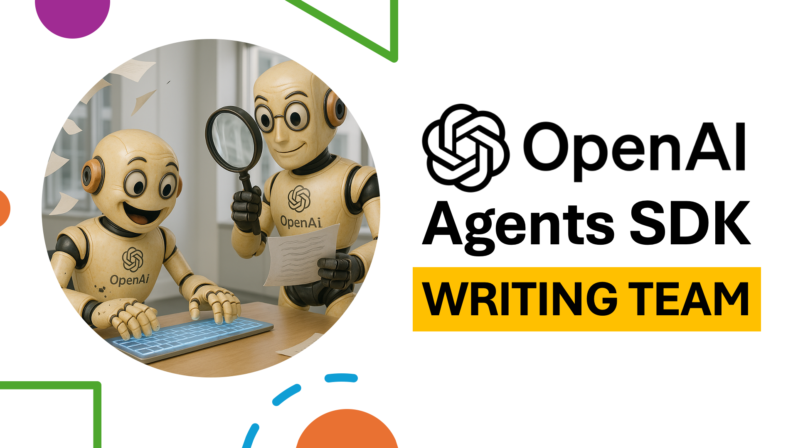

# Agentic AI Writing Tutorial



[Watch on YouTube](https://www.youtube.com/watch?v=G6wzOur-Et0)

##  By: Mohammad Hossein Amini

## Overview

🚀 Build Your Agentic AI Writing Team with OpenAI Agents SDK in Python! 🚀

In this tutorial, you'll learn how to use the OpenAI Agents SDK to create your own agentic (multi-agent) AI team featuring a Writer agent and a Critic agent. These agents work together seamlessly to generate and refine high-quality written content automatically!

## What you'll learn:

- Creating custom AI agents: Writer (content creator) and Critic (content refiner)
- Efficient agent communication and collaboration
- Defining clear conversation termination rules
- Defining custom output type for agents

## Resources

- [OpenAI Agents SDK Documentation](https://openai.github.io/openai-agents-python/)

## Who should watch?
Anyone who knows a little bit of Python.

##  Getting Started
1. Install the required packages:
   ```bash
   pip install autogen
   ```

2. Insert your OpenAI API key as `api.txt` file in the same directory as the script. The file should contain only the API key, without any additional text or formatting.

3. Run the `writing.py` script:
   ```bash
   python writing.py
   ```

4. Enjoy :)