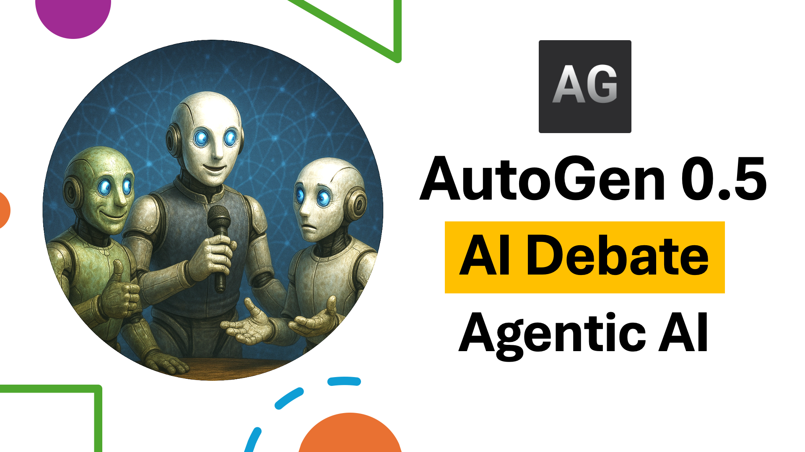

# Agentic AI Debate Application Tutorial



[Watch on YouTube](https://www.youtube.com/watch?v=c-WAkBEla48)

##  By: Mohammad Hossein Amini

## Overview

🚀 Build an Agentic AI Debate App with Autogen 0.5 and Streamlit: A Step-by-Step Tutorial 🚀

In this tutorial, you'll learn how to build your own AI Debate Agentic App using AutoGen 0.5 (the latest version) and Streamlit in Python. We'll create three LLM agents—host, supporter and critic—that engage in structured debates on any desired topic, showcasing the amazing capabilities of agentic AI systems.​

## What you'll learn:

-  Basic agentic concepts in Autogen 0.5 
-  Defining agents: AssistantAgent class in Autogen
-  Defining Round-Robin teams of agents
-  Displaying agent chats in async mode
-  Chat termination
-  Developing web application with streamlit
-  Chat visualization in streamlit

## Resources

- [Autogen Documentation](https://microsoft.github.io/autogen/stable//index.html)

- [Streamlit Documentation](https://streamlit.io/)

## Who should watch?
Anyone who knows a little bit of Python.

##  Getting Started
1. Install the required packages:
   ```bash
   pip install -U "autogen-agentchat"
   pip install "autogen-ext[openai]"
   ```

2. Insert your OpenAI API key as `api.txt` file in the same directory as the script. The file should contain only the API key, without any additional text or formatting.

3. Run the `app.py` script:
   ```bash
   streamlit run app.py
   ```

4. Enjoy :)