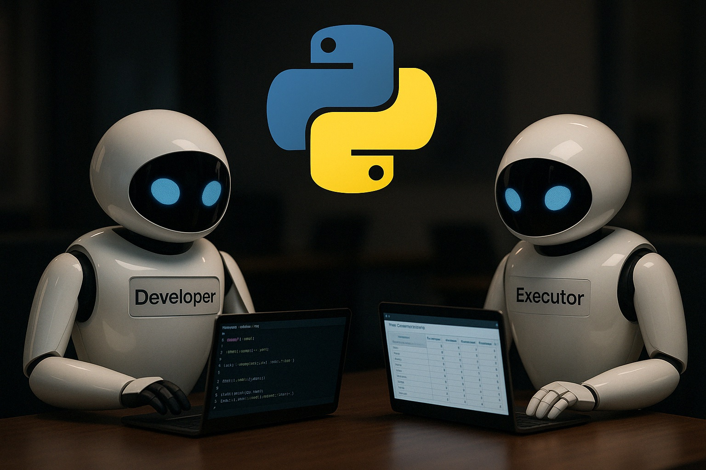

# Agentic AI Team of Code Developers Application



[Watch on YouTube](https://www.youtube.com/watch?v=8INMwnI7pJg&list=PLEe-UC96P-yaND7e6NsapElGTKfXq_cew&index=5)

##  By: Mohammad Hossein Amini

## Overview

🚀 Talk with Your Dataset: Build an Agentic AI App from Scratch in Python & Streamlit 🚀

Unlock the power of Agentic AI to interact with your data like never before. In this step‑by‑step tutorial, you’ll learn how to create two collaborative agents—Developer and Executor—that let you talk to your CSV and instantly generate visualizations and insights.

🎯 What You’ll Learn

✅  Defining the Code Developer agent (AssistantAgent) and OpenAI o3-mini LLM in Autogen 0.5
✅  Defining the Code Executor agent and docker container in Autogen 0.5
✅  Defining a team (RoundRobinGroupChat) of agents in Autogen 0.5
✅  Orchestrating the team of agents in async mode in Autogen 0.5
✅  Defining title, file upload and chat input elements in Streamlit
✅  Connecting the backend (Autogen) to the frontend (Streamlit)
✅  Setting docker image for the code executor agent in Autogen 0.5
✅  Passing memory (context) to the team of agents in Autogen 0.5
✅  Visualizing images and plots in chats in Streamlit

👥 Who Should Watch?

-  Python developers eager to level up data apps
-  Data analysts seeking faster exploratory workflows
-  AI enthusiasts curious about multi‑agent systems
-  Anyone who wants to talk to their data, not just code it!

##  Getting Started
1. Install the required packages:
   ```bash
   pip install -U "autogen-agentchat"
   pip install "autogen-ext[openai]"
   pip install "autogen-ext[docker]"
   ```

2. Insert your OpenAI API key as `api.txt` file in the same directory as the script. The file should contain only the API key, without any additional text or formatting.

3. Run the `app.py` script:
   ```bash
   streamlit run app.py
   ```

4. Enjoy :)