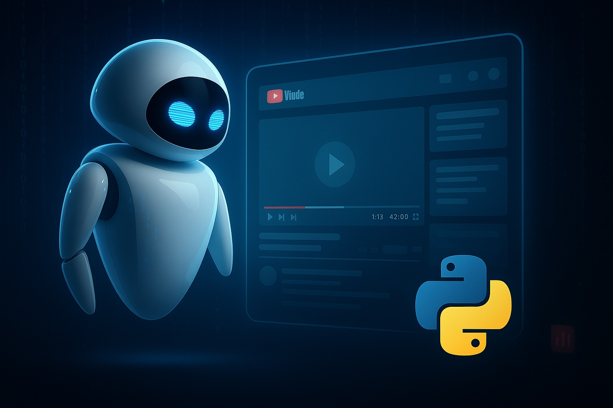

# Agentic AI Team of Code Developers Application



[Watch on YouTube](https://youtu.be/ozd85AtvgiQ)

##  By: Mohammad Hossein Amini

## Overview

🚀 Chat With **ANY** YouTube Video: Build an Agentic AI Chatbot in Python (AutoGen + Streamlit) 🚀

Ready to turn ANY YouTube video into an interactive chat experience?
In this coding tutorial you’ll learn—line by line—how to build your own Agentic AI web app that can:
    🔍 Answer questions about any public YouTube video
    📝 Summarize the content of the video
    ⏰ Find the exact timestamp of a moment you care about
All in Python, using AutoGen 0.5, OpenAI o3-mini, and Streamlit.

🎯 **What You’ll Learn**

✅  What you will see in the end with examples

✅  Using YouTube modules in Python (PyTube and YouTubeTranscriptApi) to extract video metadata

✅  Defining the YouTube AI agent (`AssistantAgent`) and OpenAI o3-mini LLM in Autogen 0.5 

✅  Communicating with the AI agent (on_messages_stream method)

✅  Testing the AI agent with several querries


✅  Defining title, text input and chat input elements in Streamlit

✅  Connecting the AI agent to the UI (Streamlit app)

✅  Two problems! (history and memory)

✅  Final words (DO IT YOURSELF!!!)


👥 **Who’s This For?**

-  Python developers who love step-by-step builds

-  AI tinkerers exploring multi-agent, agentic AI workflows

-  Anyone who’d rather chat with a video than watch the whole thing


📺 **More Projects Like This:**

https://www.youtube.com/watch?v=c-WAkBEla48&list=PLEe-UC96P-yaND7e6NsapElGTKfXq_cew&index=3

##  Getting Started
1. Install the required packages:
   ```bash
   pip install pytubefix
   pip install youtube-transcript-api
   pip install -U "autogen-agentchat"
   pip install "autogen-ext[openai]"
   ```

2. Insert your OpenAI API key as `api.txt` file in the same directory as the script. The file should contain only the API key, without any additional text or formatting.

3. Run the `app.py` script:
   ```bash
   streamlit run app.py
   ```

4. Enjoy :)