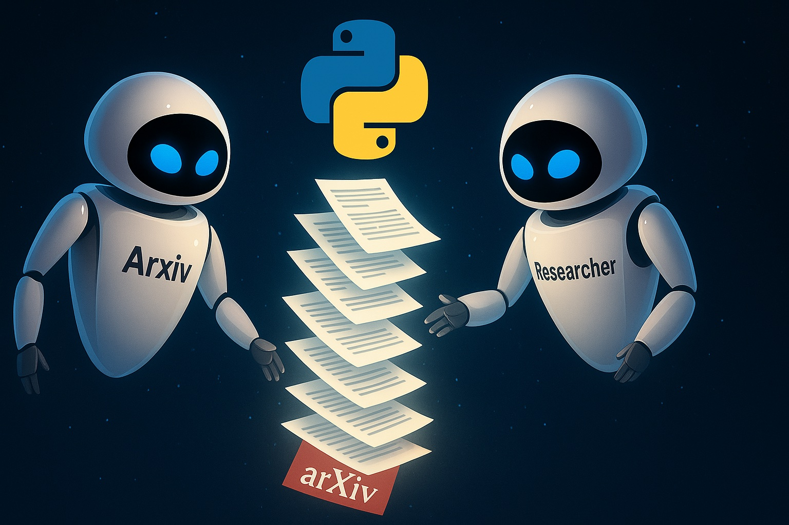

# Build AI Agents to find the best papers for you with AutoGen & Streamlit



[Watch on YouTube](https://www.youtube.com/watch?v=tMVBDP_ImEA)

##  By: Mohammad Hossein Amini

## Overview

🚀 Build AI Agents to find the best papers for you with AutoGen & Streamlit 🚀

Ready to automate your paper hunt with AI?
In this step-by-step coding tutorial you’ll learn—line by line—how to build a web app that uses two collaborative agents to:

🔍 Search ArXiv for the most relevant papers on any topic
📝 Summarize each paper’s core problem and solution
📑 Generate a cohesive research report with a single click

All in Python, using AutoGen 0.5, OpenAI o4-mini, and Streamlit.

🎯 **What You’ll Learn**

✅  Defining the Arxiv Search AI Agent (`AssistantAgent`) and OpenAI o3-mini LLM in Autogen 0.5 
✅  Using Arxiv API in Python to search for papers in Arxiv
✅  Defining the Researcher AI Agent (`AssistantAgent`) to generate a research report
✅  Testing the AI agents with several querries
✅  Defining title, text input and chat input elements in Streamlit
✅  Connecting the AI agent to the UI (Streamlit app)
✅  Final words (DO IT YOURSELF!!!)

👥 **Who’s This For?**

-  Python developers who love step-by-step builds
-  Python developers automating research workflows
-  Grad students streamlining literature reviews
-  AI enthusiasts exploring multi-agent agentic AI

📺 **More Projects Like This:**

https://www.youtube.com/watch?v=c-WAkBEla48&list=PLEe-UC96P-yaND7e6NsapElGTKfXq_cew&index=3

##  Getting Started
1. Install the required packages:
   ```bash
   pip install arxiv
   pip install -U "autogen-agentchat"
   pip install "autogen-ext[openai]"
   ```

2. Insert your OpenAI API key as `api.txt` file in the same directory as the script. The file should contain only the API key, without any additional text or formatting.

3. Run the `app.py` script:
   ```bash
   streamlit run app.py
   ```

4. Enjoy :)