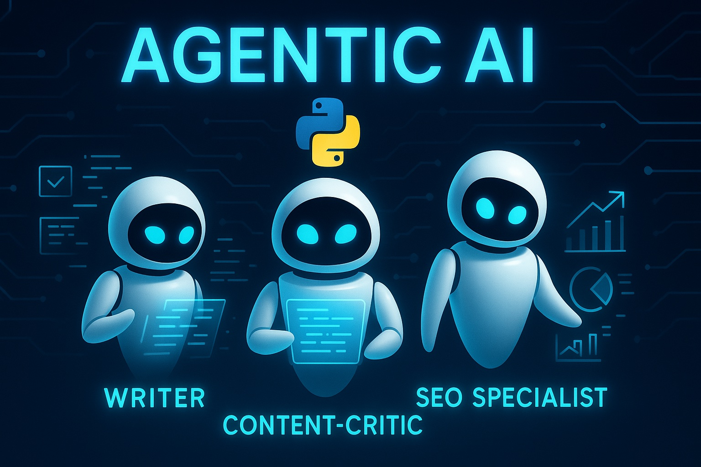

# [Python 2025 Step by Step] Build an Agentic AI Chatbot That Generates **Any** SEO-Friendly Content



[Watch on YouTube](https://youtu.be/Cvrf9MGAAP4)

##  By: Mohammad Hossein Amini

## Overview

🚀 Build an Agentic AI Chatbot that Generates ANY SEO-Optimized Content! [Step-by-Step Python Tutorial]

Ready to create a powerful Agentic AI chatbot web app that produces high-quality, SEO-friendly content on demand? In this detailed Python tutorial, you'll learn—line by line—how to develop a sophisticated chatbot using three collaborative AI agents:

✅ Writer Agent – Crafts engaging content on any topic.

✅ Content-Critic Agent – Reviews and provides feedback on grammar, style, and clarity.

✅ SEO Specialist Agent – Ensures content is perfectly optimized for search engines.

All powered by Python, AutoGen 0.5, OpenAI o3-mini, and Streamlit!

🎯 What You’ll Learn

✅ Defining the writer agent (`AssistantAgent` in AutoGen) 

✅ How does Selector Group Chat work in AutoGen

✅ Defining the content-critic agent and SEO-critic agent (`AssistantAgent` in AutoGen)

✅ Defining the team of agents (`SelectorGroupChat`) in AutoGen

✅ Make the agent generate **structured output**

✅ How to define custom termination condition in AutoGen

✅ Defining title and chat input in Streamlit

✅ Connecting the AI agents to the UI (Streamlit web app)

✅ How to display previous chats in the web application

✅ How to provide access to the previous chats for the team of agents

✅ Choosing avatars for the agents

👥 Who Should Watch This Tutorial?

- Python developers looking to create advanced agentic AI chatbots

- Content creators aiming to enhance their SEO strategy

- AI enthusiasts eager to dive into multi-agent AI systems

🔥 More Agentic AI Tutorials You'll Love:
https://www.youtube.com/watch?v=c-WAkBEla48&list=PLEe-UC96P-yaND7e6NsapElGTKfXq_cew&index=3&pp=0gcJCR0AztywvtLA


##  Getting Started
1. Install the required packages:
   ```bash
   pip install -U "autogen-agentchat"
   pip install "autogen-ext[openai]"
   ```

2. Insert your OpenAI API key as `api.txt` file in the same directory as the script. The file should contain only the API key, without any additional text or formatting.

3. Run the `app.py` script:
   ```bash
   streamlit run app.py
   ```

4. Enjoy :)