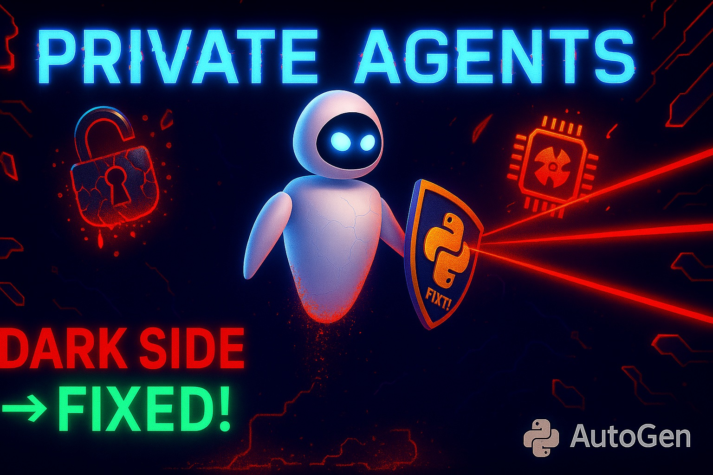

# 🚀 The Dark Side of Local AI Agents: How to Fix Them (AutoGen + Ollama + Python)



[Watch on YouTube](https://youtu.be/WdBXgYsEXcE)

## By: Mohammad Hossein Amini

## Overview

🔒 Learn to build **Local Private AI Agents** using AutoGen and Python while tackling the common issues that developers face! This step-by-step guide helps you integrate local LLMs (Ollama, LLama3.2, DeepSeek, Qwen3) with AutoGen, revealing hidden challenges and providing robust solutions.

### 🎯 What You’ll Learn

✅ Integrating Ollama local LLM with AutoGen

✅ Building AI Agents with Ollama and AutoGen

✅ Using PyPDF for reading PDF files in Python

✅ Addressing LLama3.2 instruction-following issues

✅ Working effectively with DeepSeek (deepseek-r1)

✅ Handling tool-calling limitations in DeepSeek

✅ Implementing and experimenting with Qwen3 in Ollama

✅ Running AI agents in loops using RoundRobinGroupChat

✅ Identifying and overcoming Qwen3's limitations

✅ Advanced prompt engineering techniques for local LLMs

✅ Comparison of local LLMs with ChatGPT GPT4-o

### 👥 Who Should Watch?

- 🐍 Python developers interested in reducing API costs and overcoming rate limits
- 🔐 Data scientists prioritizing data privacy
- 🛠️ AutoGen users aiming to enhance their AI agent setups with local LLMs

### 🔥 Playlist Suggestion

Level up with more tutorials from the **Agentic AI Tutorials** playlist, featuring advanced agent orchestration, Streamlit applications, and innovative AI techniques.

👉 [Watch the Playlist](https://www.youtube.com/watch?v=c-WAkBEla48&list=PLEe-UC96P-yaND7e6NsapElGTKfXq_cew&index=3&pp=0gcJCR0AztywvtLA)

## 📂 Getting Started

### 1. Install the required packages:

```bash
pip install -U "autogen-agentchat"
pip install "autogen-ext[ollama]"
pip install ollama
pip install pypdf
```

### 2. Setup local models with Ollama:

```bash
ollama pull llama3.2
ollama pull deepseek-r1
ollama pull qwen3:1.7b
```

### 3. Run your AI agent script:

```bash
python agent.py
```

### 4. Enjoy! 🚀

## ❓ Have a Question?

Drop your questions in the comments on YouTube or open an issue in the GitHub repository—I’m here to help! Don't forget to Like 👍 and Subscribe for more practical, AI Agent tutorials!
